# MEDICAL CHARTS INDEXER - Web Application for NLP on AWS using SentenceTransformers and WordCloud

***

## Description :-

Medical charts, used extensively in clinical or health insurance settings, are extremely valuable to identify clinical aspects of a patient. This project saves time and accuracy in finding these clinical aspects, which would otherwise have to be done by an errorprone manual effort for many hours.

<a href="https://www.sbert.net/">SentenceTransformers</a> is a Python framework for Natural Language Processing (NLP). It can be used to compute sentence and text embeddings. This project uses SentenceTransformers to compute semantic similarity between pre-defined diagnosis codes/labels and text in medical charts. A wordcloud is also computed so as to quickly grasp dominant themes in the medical chart.

The web application in this project is developed in Python by creating a RESTApi using <a href="https://fastapi.tiangolo.com/">FastApi</a> on <a href="https://aws.amazon.com/">Amazon Web Services</a> using <a href="https://aws.amazon.com/s3/?nc2=h_ql_prod_st_s3">Amazon S3</a>, <a href="https://aws.amazon.com/sqs/?nc2=h_ql_prod_ap_sqs">Amazon SQS</a>, <a href="https://aws.amazon.com/lambda/?nc2=h_ql_prod_fs_lbd">AWS Lambda</a>, <a href="https://aws.amazon.com/cloudformation/">AWS Cloudformation</a>. Pre-computation for text embeddings is done on . 

At a high level, these are the steps:

1. Pre-compute text embeddings on Google Colab. Download embeddings and transformed diagnosis codesfile. This is necessary for high speed in the web application itself.
2. Create AWS Lambda function using SAM CLI. Create AWS S3 buckets and AWS SQS queue using AWS Cloudformation.
3. Add permissions policy to the AWS Lambda role. Set the AWS Lambda function to trigger on S3 file upload. 
4. User uploads a medical chart (pdf) on the web app. When this file is saved to AWS S3, the AWS Lambda function get triggered to push the name of the S3 file to AWS SQS queue. When user chooses to process, 
    * S3 file name is read from the queue, 
    * S3 file is read from S3 bucket,
    * Text in the file is extracted, 
    * Semantic similarity score is computed using SentenceTransformers,
    * Presence of diagnosis code in the text is determined,
    * Output is written to a separate AWS S3 bucket. User has an option to download the output.
5. Use can also choose to create a word cloud, which again the user has an option to download.

***

## Screenshots :-
AWS Cloudformation Stack
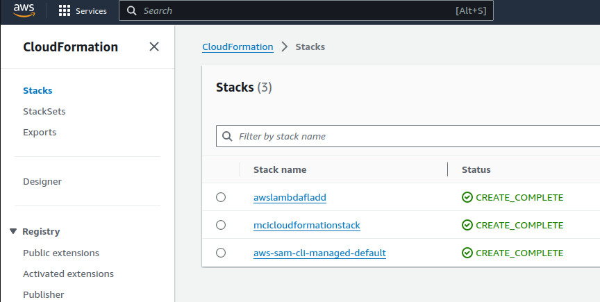

AWS Lamda Trigger on S3 Upload
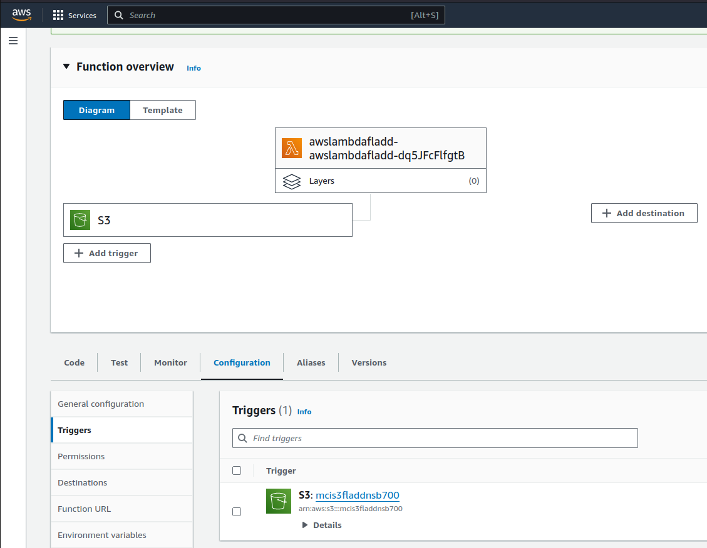

AWS Policy for Lambda IAM Role
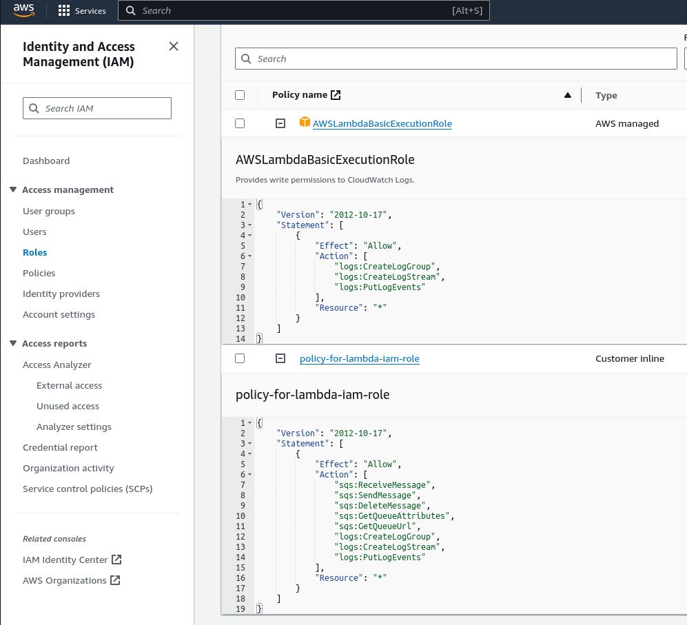

Web Application FastApi Swagger
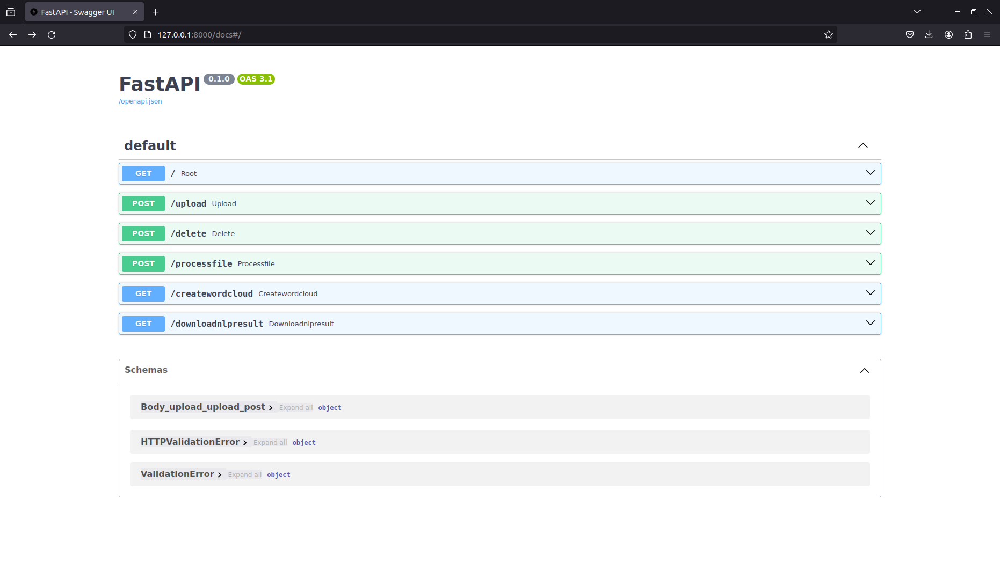

Upload file in Web App
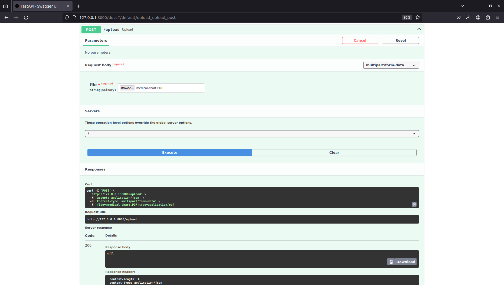

File in S3 bucket
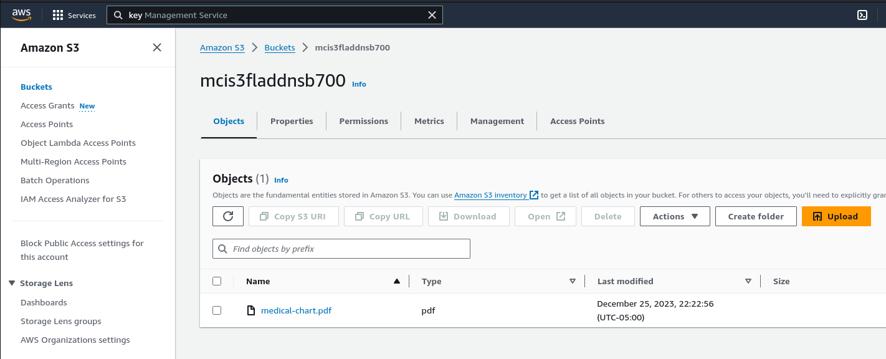

AWS Lambda function code triggered on S3 file upload. File name is sent as a message on SQS queue
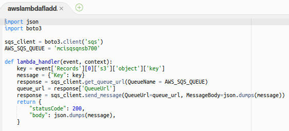

AWS Cloudwatch logs after AWS Lambda function executes
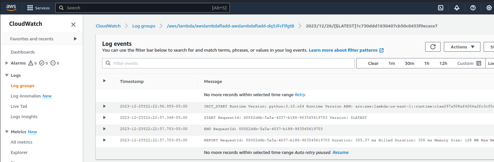

Message visible on SQS queue
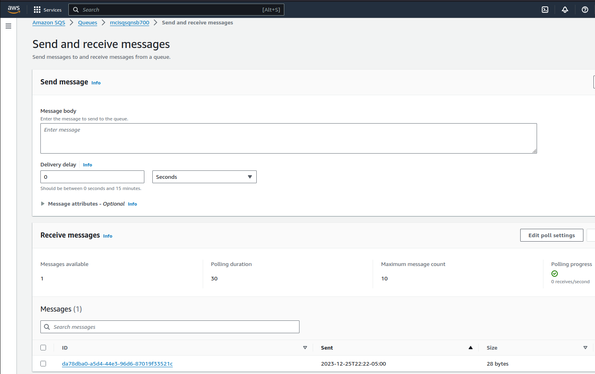

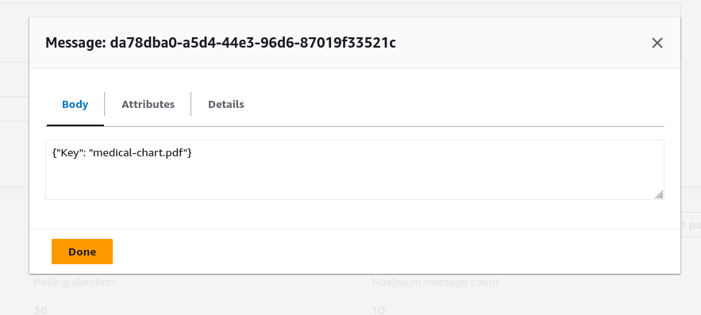

Process file in web app. Response contains the name of the NLP result file. Copy this name so as to download in next steps.
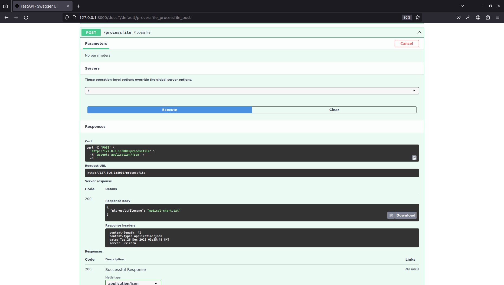

NLP Result file created in a separate S3 bucket
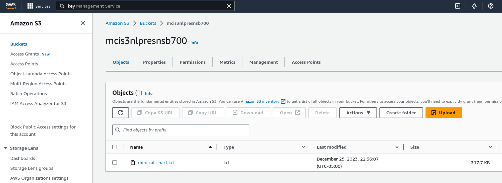

Download NLP result file in web app by pasting its name. 'Downlod file' link is created enabling the download
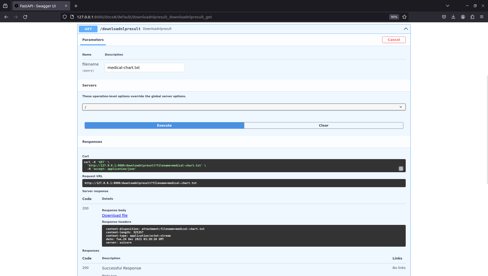

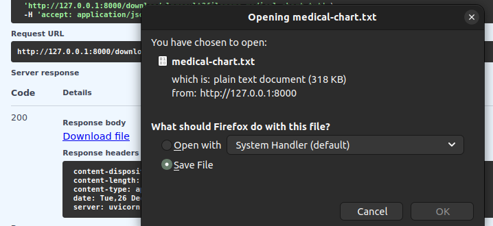

Output file
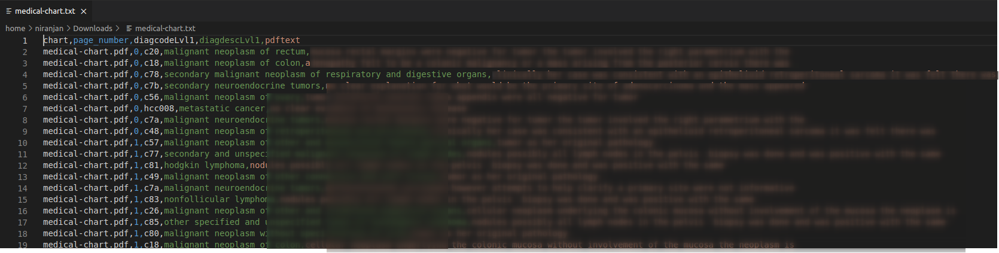

Create WordCloud in web app by pasting the name of the NLP result file. Response contains the name of the WordCloud result file. Copy this name so as to download in next step.
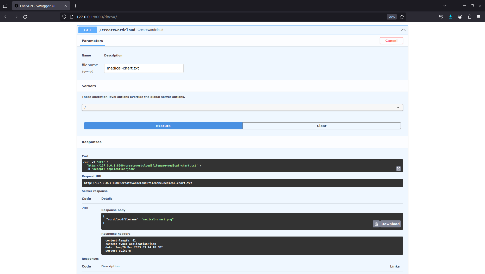

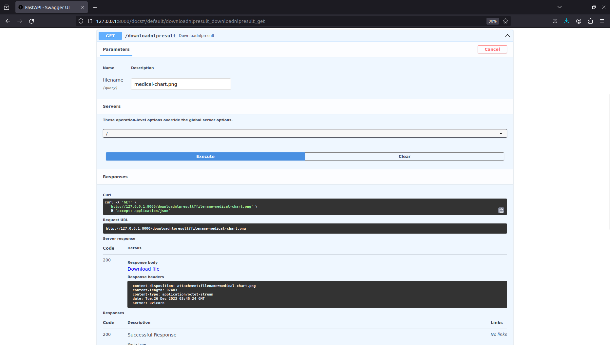

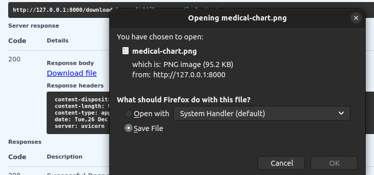

WordCloud
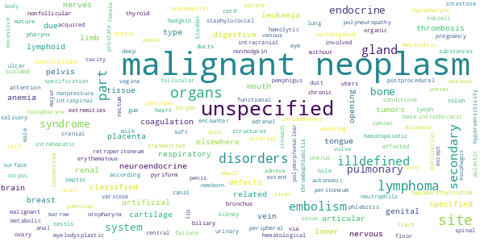

***